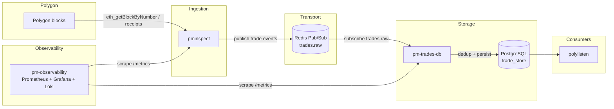

# Architecture Overview

`pminspect` is the ingestion edge of the pm trade-intelligence platform. This document
shows how it fits into the broader stack.

## System diagram



## ASCII equivalent

```
                    ┌──────────────────┐
                    │    Polygon       │
                    │    blocks        │
                    └────────┬─────────┘
                             │ eth_getBlockByNumber / receipts
                             ▼
                    ┌──────────────────┐   /metrics (Prometheus)
                    │   pminspect      │◄──────────────────────┐
                    │  (this repo)     │                       │
                    └────────┬─────────┘                       │
                             │ publish trade events            │
                             ▼                                 │
                    ┌──────────────────┐                       │
                    │  Redis Pub/Sub   │                       │
                    │  trades.raw      │                       │
                    └────────┬─────────┘                       │
                             │ subscribe                       │
                             ▼                                 │
                    ┌──────────────────┐   /metrics            │
                    │  pm-trades-db    │◄──────────────────────┤
                    │  consumer        │                       │
                    └────────┬─────────┘                       │
                             │ dedup + persist                 │
                             ▼                                 │
                    ┌──────────────────┐                       │
                    │  PostgreSQL      │                       │
                    │  trade_store     │                       │
                    └────────┬─────────┘                       │
                             │                                 │
                             ▼                                 │
                    ┌──────────────────┐                       │
                    │   polylisten     │                       │
                    │   (web)          │                       │
                    └──────────────────┘                       │
                                                               │
                    pm-observability: Prometheus + Grafana +   │
                    Loki, scraping pminspect & pm-trades-db    │
                    ───────────────────────────────────────────┘
```

## Data flow

1. **pminspect** listens to Polygon blocks (primary/secondary WSS or RPC endpoints),
   extracts Polymarket `Trade` events, and publishes each validated event to Redis
   Pub/Sub on the `trades.raw` channel.
2. **pm-trades-db** subscribes to `trades.raw`, deduplicates events, and persists them
   to PostgreSQL (`trade_store`), with incremental backups.
3. **polylisten** serves the aggregated trade data to the web UI at
   <https://polylisten.com>.
4. **pm-observability** scrapes `/metrics` from both `pminspect` and `pm-trades-db`
   into Prometheus, with Grafana dashboards and Loki log aggregation.

## Repos in this stack

| Repo | Role |
|---|---|
| [pm-inspect](https://github.com/nicknacknow/pm-inspect) | Polygon block listener → Redis pub/sub publisher |
| [pm-trades-db](https://github.com/nicknacknow/pm-trades-db) | Redis → Postgres consumer (dedup, incremental backups) |
| [polylisten](https://github.com/nicknacknow/polylisten) | Web product (private) — trade intelligence UI |
| [pm-observability](https://github.com/nicknacknow/pm-observability) | Prometheus + Grafana + Loki stack |

## Topics

- `trades.raw` — raw trade events published by `pminspect` (see
  [Event shape](../README.md#event-shape))
- `trade_store` — PostgreSQL database owned by `pm-trades-db`
